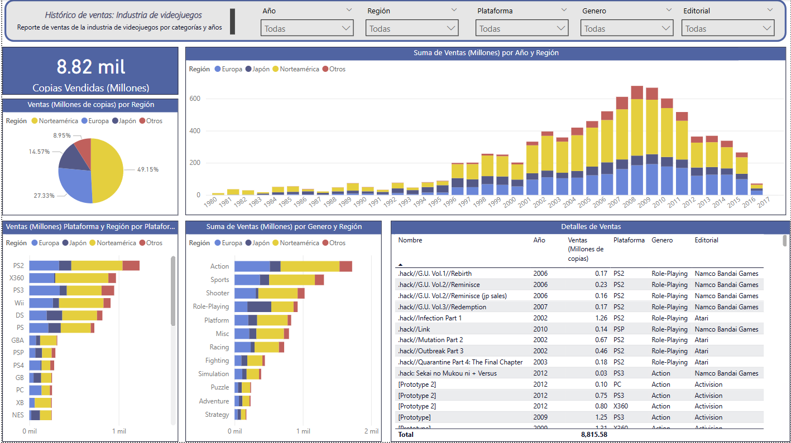

# videogames-dashboard
This project showcases an interactive dashboard developed in Power BI that analyzes video game sales from 1980 to 2017, with filters by year, region, platform, genre, and publisher.

## 📌 Objective
To visualize historical trends in the video game industry and analyze platform and genre performance over time.

## 📷 Dashboard Preview

## 📁 Project Structure

- `Dashboard.pbix`: Original Power BI dashboard file.
- `assets/`: Contains graphical resources like screenshots.
- `data/`: Contains the dataset used (if it can be shared).
- `README.md`: Explanation and project documentation.

## 🔍 Key Visualizations

- Total units sold: 8.82 billion copies
- Sales by region (North America, Europe, Japan, Others)
- Sales by year and region
- Sales by platform
- Sales by game genre
- Detailed sales table by game, year, platform, genre, and publisher

## 🛠️ Tools Used

- Power BI
- Microsoft Excel / CSV (for data source)
- Git and GitHub for version control
